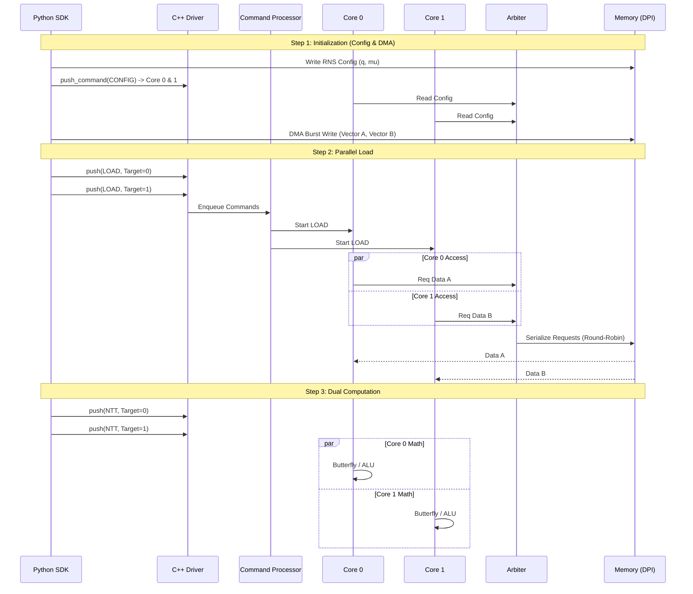

# Архитектура Logos FHE Accelerator (v6.0 Dual Core)

## C2: Container Diagram (System Context)

Система представляет собой гибридный эмулятор, где высокоуровневая логика управляется Python, а "железо" симулируется через Verilator.

```mermaid
graph TD
    User[User / Python Test] -->|LogosDriver| SDK[Python SDK\n(logos_sdk.py)]
    SDK -->|PyBind11| CPP[C++ Driver\n(emulator_core)]
    
    subgraph "Hardware Simulation (Verilator)"
        CPP -->|DPI-C| SIM[Top Level: Logos Core]
        
        subgraph "Control Plane"
            CP[Command Processor]
        end
        
        subgraph "Compute Plane"
            C0[Core 0\n(NTT Engine + ALU)]
            C1[Core 1\n(NTT Engine + ALU)]
        end
        
        subgraph "Memory Fabric"
            ARB[Memory Arbiter\n(Blocking Round-Robin)]
            DPI[DPI Memory Wrapper]
        end
        
        MEM[(Host RAM\nSparse Map 1TB)]
    end

    SDK -->|DMA Write| MEM
    CPP -->|Push Command| CP
    CP -->|Dispatch| C0
    CP -->|Dispatch| C1
    
    C0 <-->|Req/Gnt| ARB
    C1 <-->|Req/Gnt| ARB
    ARB <-->|Valid/Data| DPI
    DPI <-->|Native Call| MEM
```

---

## C3: Data Flow (Parallel Execution Scenario)

Сценарий "Алмазная Петля" (Diamond Loop): Параллельная обработка двух векторов.



---

## Компоненты Системы (v6.0)

### 1. Command Processor (`command_processor.v`)
*   **Функция:** Декодирует 64-битные команды и маршрутизирует их к нужному ядру.
*   **Маршрутизация:** Использует бит `[48]` адреса (`0` -> Core 0, `1` -> Core 1).
*   **Синхронизация:** Учитывает сигналы `ready` от ядер, реализуя Backpressure для C++ драйвера.

### 2. Memory Arbiter (`mem_arbiter.v`)
*   **Тип:** Blocking Round-Robin.
*   **Клиенты:** Host DMA (наивысший приоритет), Core 0, Core 1.
*   **Логика:**
    *   Чередует доступ между ядрами, чтобы предотвратить голодание (Starvation).
    *   Блокирует новые запросы на чтение (`Req`), пока текущая транзакция не завершится (`Valid`), защищая от перемешивания данных.

### 3. NTT Engine (`ntt_engine.v`)
*   **Роль:** Универсальное вычислительное ядро.
*   **Режимы:**
    *   `DMA Read`: Конвейерное чтение с предсказанием адреса (Lookahead).
    *   `DMA Write`: Burst-запись в режиме "Fire-and-Forget" (без подтверждения).
    *   `Calc`: Выполнение NTT/INTT (Cooley-Tukey).
    *   `ALU`: Векторное сложение и умножение.
    *   `Config`: Загрузка параметров RNS ($q, \mu, n^{-1}$).

### 4. DPI Layer (`dpi_impl.cpp` & `dpi_mem_wrapper.v`)
*   **Hybrid Bridge:** C++ экспортирует символы с префиксами `dpi_` и `py_` для совместимости.
*   **Storage:** `std::map` эмулирует разреженную память объемом до 1 ТБ.
*   **Write Opt:** Запись считается мгновенной (0 тактов latency со стороны симулятора).

