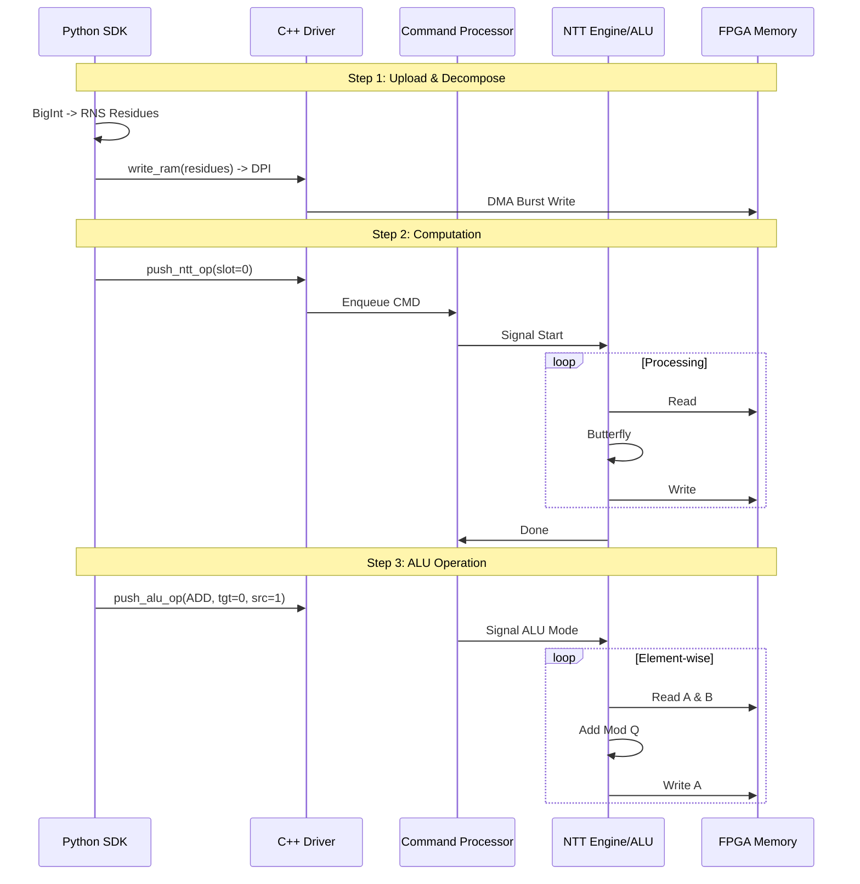

# Архитектура Logos FHE Accelerator (v3.0)

## C2: Container Diagram (System Context)

```mermaid
graph TD
    User[User / Python Test] -->|High Level API| SDK[Python SDK\n(LogosContext)]
    SDK -->|RNS Math| Math[RNS Math Core\n(CRT/Primes)]
    SDK -->|Native Calls| CPP[C++ Driver\n(emulator_core)]
    
    subgraph "Hardware Emulation Boundary"
        CPP -->|DPI-C| SIM[Verilator Simulation]
        
        subgraph "Logos Core (Verilog)"
            CP[Command Processor]
            NTT[NTT Engine]
            ALU[Vector ALU]
            
            MEM[(Multi-Bank RAM\n4 x 4096 words)]
            TWID[(Twiddle RAM\nDynamic Factors)]
        end
        
        CP -->|Control| NTT
        CP -->|Control| ALU
        NTT <-->|Read/Write| MEM
        ALU <-->|Read/Write| MEM
        NTT <-->|Read| TWID
    end
```

## C3: Data Flow (Diamond Loop Scenario)


